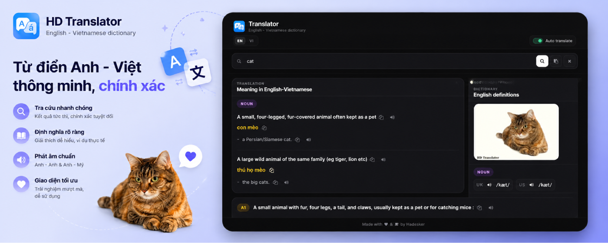
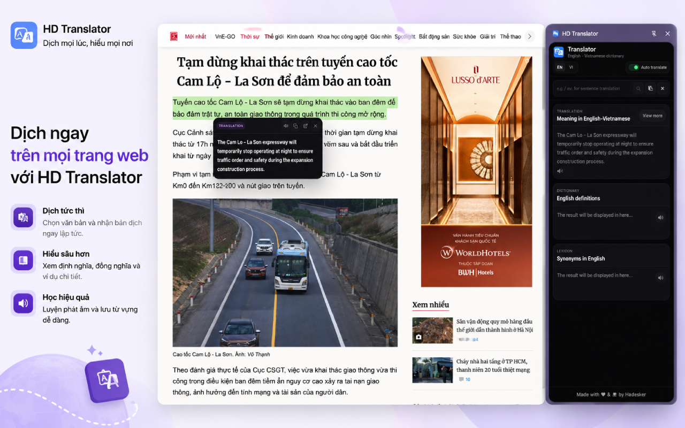
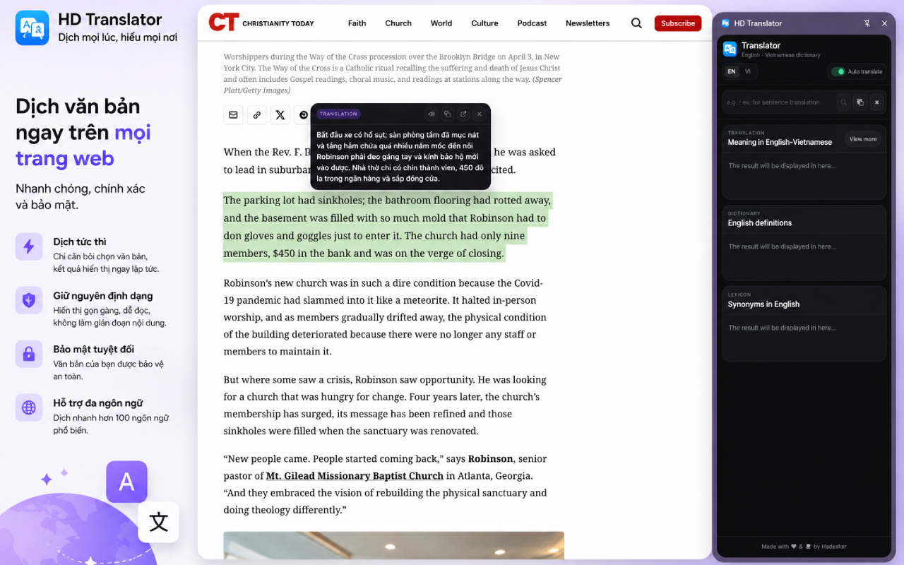

# HD Translator

[English](README.md) | [🇻🇳 Tiếng Việt](README.vi.md)

HD Translator is a browser extension for English-Vietnamese and Vietnamese-English dictionary lookup and translation.

## Install From Store

- [Chrome Web Store](https://chromewebstore.google.com/detail/hd-translator/likbjifbakomfhmnmhejipopjadcmpbe)
- [Firefox Add-ons](https://addons.mozilla.org/vi/firefox/addon/hd-translator)

## Screenshots







## Purpose

HD Translator helps users read documents, learn English, and look up words quickly without switching between tabs. Users can open the dictionary in the browser side panel, select text on a webpage for quick translation, listen to pronunciation, and copy results when needed.

## Main Features

- Look up English-Vietnamese and Vietnamese-English words.
- Quickly translate selected text on webpages.
- Show a small inline translation popup next to selected text when auto translate is enabled.
- Open a full lookup interface in Chrome Side Panel or Firefox Sidebar.
- View meanings, English definitions, examples, synonyms, IPA, and pronunciation.
- Listen to pronunciation using available audio or browser speech.
- Copy words, examples, and translations.
- Switch the interface language between English and Vietnamese.
- Translate sentences in the search box using `.ve.` / `.ev.` prefixes.

## Requirements

- Node.js.
- Chrome or a Chromium-based browser that supports Manifest V3.
- Firefox, if you want to build the Firefox version.

This repository does not require any extra npm packages to build the extension.

## Build

Build the Chrome version:

```sh
node scripts/build-extension.js chrome
```

The output is created at:

```text
dist/chrome
```

Build the Firefox version:

```sh
node scripts/build-extension.js firefox
```

The output is created at:

```text
dist/firefox
```

Build and create store upload zip files:

```sh
node scripts/build-extension.js chrome zip
node scripts/build-extension.js firefox zip
```

The zip files are created at:

```text
dist/chrome.zip
dist/firefox.zip
```

The zip files are created by the build script to avoid macOS hidden files such as `.DS_Store`, `._*`, or `__MACOSX`.

## Install Unpacked On Chrome

1. Build the Chrome version:

```sh
node scripts/build-extension.js chrome
```

2. Open Chrome and go to:

```text
chrome://extensions
```

3. Enable **Developer mode**.
4. Click **Load unpacked**.
5. Select this folder:

```text
dist/chrome
```

6. After installation, click the HD Translator icon on the toolbar to open the extension in the Side Panel.

## Temporary Installation On Firefox

1. Build the Firefox version:

```sh
node scripts/build-extension.js firefox
```

2. Open Firefox and go to:

```text
about:debugging#/runtime/this-firefox
```

3. Click **Load Temporary Add-on...**.
4. Select this file:

```text
dist/firefox/manifest.json
```

5. After installation, open HD Translator from the Firefox toolbar or sidebar.

Note: Temporary Firefox add-ons are removed when the browser closes. Load the add-on again if you want to continue testing.

## Build Structure

- `manifest.json`: main Chrome MV3 manifest.
- `manifest.chrome.json`: manifest used for the Chrome build.
- `manifest.firefox.json`: manifest used for the Firefox build.
- `src/pages`: popup/sidebar interface.
- `src/scripts`: background script and content script.
- `src/assets`: CSS, JavaScript, icons, and UI libraries.
- `scripts/build-extension.js`: packages the extension into `dist/chrome` or `dist/firefox`.
- Add the `zip` or `--zip` argument to create a clean store upload zip file in `dist`.

## Author

- Author: [Hadesker](https://hadesker.dev)
- Email: hello@hadesker.net

## License

This project is released under the MIT License. See [LICENSE](LICENSE) for details.
